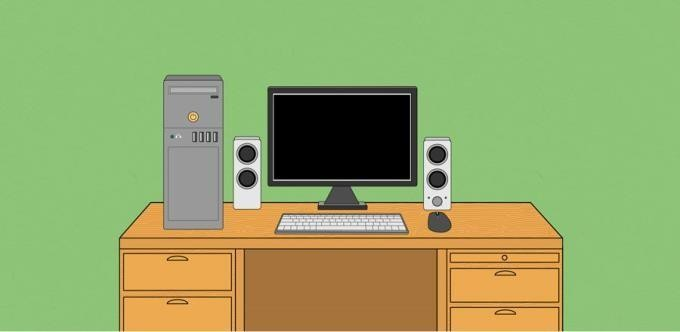
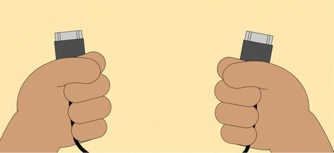
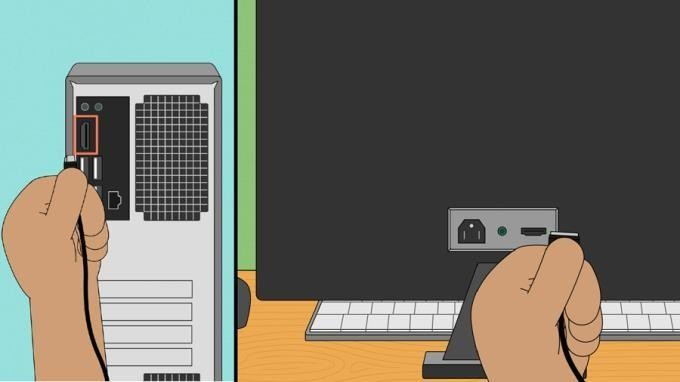
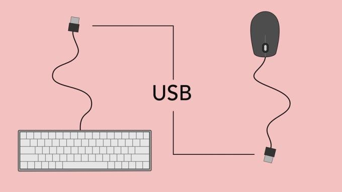
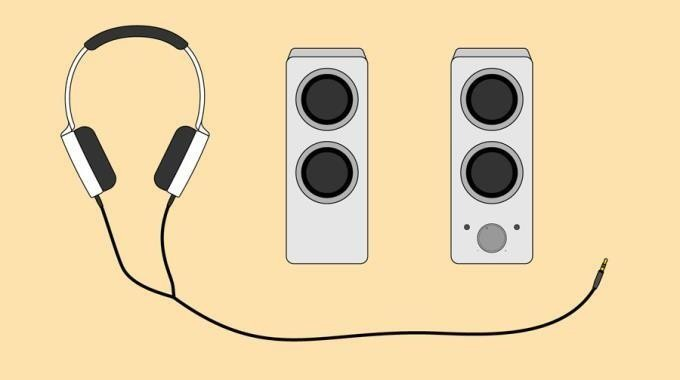
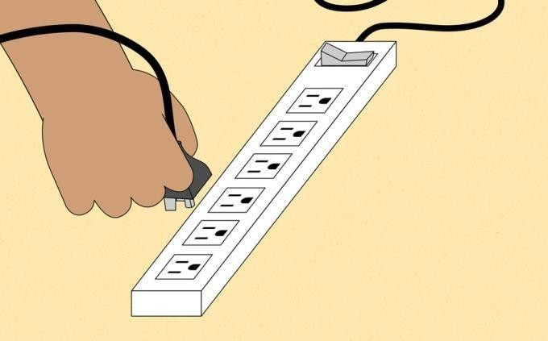
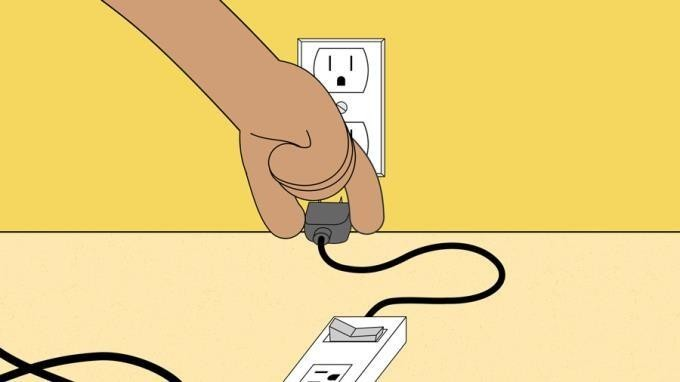
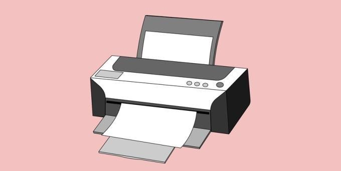

# OS-EX-1-Assembling-the-System---CASE-STUDY

## EXP.NO: 1

## DATE:

## AIM:

To Assemble the Computer System

## PROCEDURE:

### Step 1

Unpack the monitor and computer case from the box. Remove any
plastic covering or protective tape. Place the monitor and computer case
on a desk or work area.Be sure to place your computer case in an area
that is well ventilated and has good air flow. This will help to prevent the
computer from overheating.

### Step 2

Locate the monitor cable. There are several types of monitor cables, so
the one for your computer may not look like the one in the image
below.If you're having trouble finding your monitor cable, refer to the
instruction manual for your computer. (If you have an all-inone computer that's built into the monitor, you can skip to Step 4).

### Step 3

Connect one end of the cable to the monitor port on the back of
the computer case and the other end to the monitor. Many computer
cables will only fit a specific way. If the cable doesn't fit, don't force it or
you might damage the connectors. Make sure the plug aligns with the
port, then connect it.To figure out which cables belong in which ports,
try our Connecting Cables interactive.

### Step 4

Unpack the keyboard and determine whether it uses a USB (rectangular)
connector or a PS/2 (round) connector. If it uses a USB connector, plug it
into any of the USB ports on the back of the computer. If it uses a PS/2
connector, plug it into the purple keyboard port on the back of the
computer.

### Step 5

Unpack the mouse and determine whether it uses
a USB or PS/2 connector. If it uses a USB connector, plug it into any of
the USB ports on the back of the computer. If it uses a PS/2 connector,
plug it into the green mouse port on the back of the computer.If your
keyboard has a USB port, you can connect your mouse to the keyboard
instead of connecting it directly to your computer.If you have
a wireless mouse or keyboard, you may need to connect a
Bluetooth dongle (USB adapter) to your computer. However, many
computers have built-in Bluetooth, so an adapter may not be necessary.

### Step 6

If you have external speakers or headphones, you can connect them to
your computer's audio port (either on the front or back of the computer
case). Speakers or headphones connect to the green port,
and microphones connect to the pink port. The blue port is the line in,
which can be used with other types of devices.Some speakers,
headphones, and microphones have USB connectors instead of the usual
audio plug. These can be connected to any USB port. In addition, many
computers have speakers or microphones built into the monitor.

### Step 7

Locate the two power supply cables that came with your computer. Plug
the first power supply cable into the back of the computer case and then
into a surge protector. Then, using the other cable, connect
the monitor to the surge protector.You can also use an uninterruptable
power supply (UPS), which acts as a surge protector and provides
temporary power if there is a power outage.

### Step 8

Finally, plug the surge protector into a wall outlet. You may also need to
turn on the surge protector if it has a power switch.If you don't have a
surge protector, you can plug the computer directly into the wall.
However, this is not recommended because electrical surges can
damage your computer.

### Step 9

If you have a printer, scanner, webcam, or other peripherals, you can
connect them at this point. Many peripherals are plug and play, which
means they will be recognized by your computer as soon as they are
plugged in.Other peripherals may include software that needs to be
installed before you can begin using them. Use the instructions included
with the device to install it if necessary.
